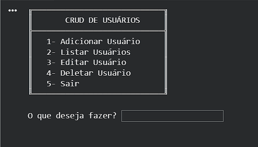
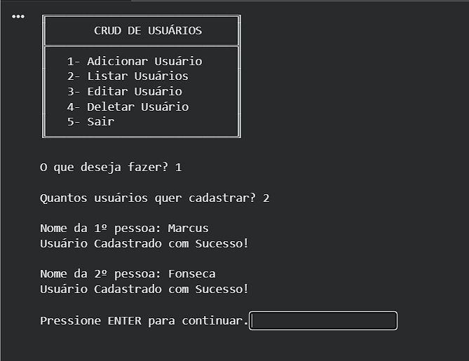
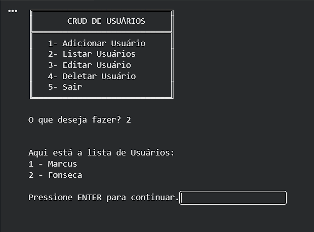
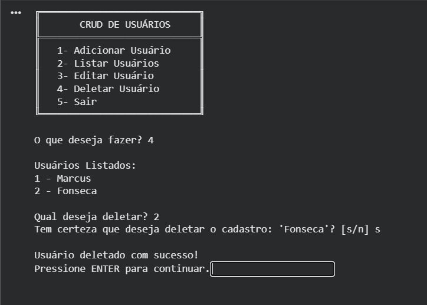
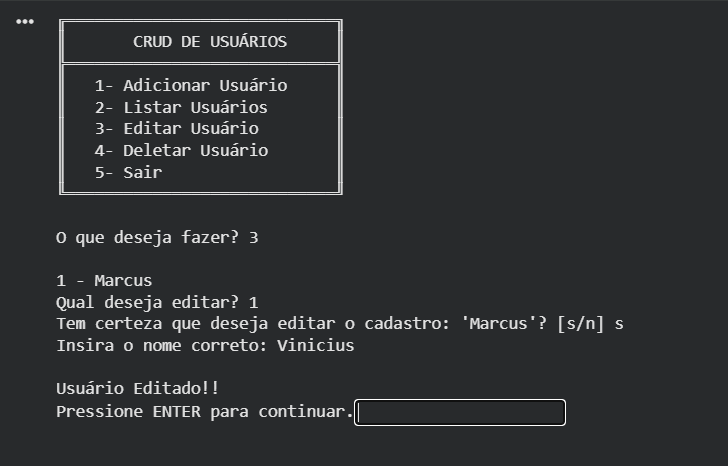
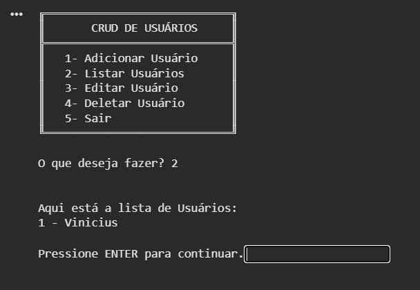

# 🧑‍💻 CRUD de Usuários em Python

Projeto de um sistema CRUD (Create, Read, Update, Delete) desenvolvido em Python, com foco em prática de lógica de programação, validação de dados e interação via terminal.

## 🚀 Funcionalidades

- ✅ Adicionar usuários

- 📋 Listar usuários cadastrados

- ✏️ Editar usuários

- 🗑️ Deletar usuários

- 🔒 Validação de entradas (números, campos vazios, opções inválidas)

- 🧼 Limpeza de tela para melhor experiência no terminal

## 🛠️ Tecnologias utilizadas

- Python 3

- Estruturas de repetição (while, for)

- Estruturas condicionais (if, match case)

- Tratamento de exceções (try/except)

- Listas para armazenamento de dados

### Biblioteca:

- ```IPython.display.clear_output``` (para limpeza do terminal)

## 💡 Objetivo do projeto

Este projeto foi desenvolvido com o objetivo de fortalecer minha base em programação, trabalhando conceitos fundamentais como:

- Lógica de programação

- Validação de dados

- Controle de fluxo

- Manipulação de estruturas de dados

Além disso, busquei melhorar a experiência do usuário mesmo em um ambiente de terminal, simulando uma interface mais limpa e organizada.
## 🔄 Próximos passos

- 🔧 Refatorar o código utilizando funções para melhorar organização e reutilização

- 🎨 Criar uma interface visual (GUI ou Web) para melhorar a experiência do usuário

- 📦 Evoluir a estrutura de dados (ex: adicionar idade, email, etc.)

- 🌐 Transformar em aplicação web utilizando Flask

## 📌 Como executar
1. "```pip install ipython```" (Para o programa conseguir limpar o terminal. É levinho, pode baixar! :) )
2. "```python crud.py```" no terminal

## 📸 Demonstração

### 1. Menu


### 2. Cadastro


### 3. Lista Inicial


### 4. Exclusão


### 5. Edição


### 6. Lista Final


## 👨‍💻 Autor

### Desenvolvido por Marcus Vinicius
